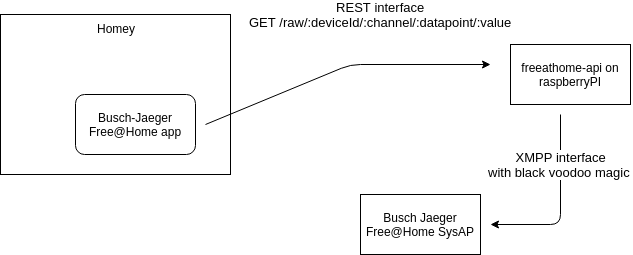

[](http://commitizen.github.io/cz-cli/)

# Bush Jeager Free@Home

Adds support for Busch Jaeger's Free@home system and its connected devices to Homey

This is not an official application, but a hobby project. Tread lightly


### Scope
Currently, this app supports a device discovery for a limited set of actuators:

- Some "Sensor/ Schaltaktor 2/2-fach" are supported (deviceId's: 1010)
- Some "Sensor/ Schaltaktor 1/1-fach" are supported (deviceId's: 1017, 100C, 2039)
- Some "Sensor/ Schaltaktor 2/1-fach" are supported (deviceId's: 1019)
    
with the capability of turning the actor 'on' and 'off'.

For each device the name will be used as it is configured in the SysAp.

## Using functionId from SysAp
There is an MR in freeathome-api to expose a channels functionId. This allows to not have to parse deviceIds and 
having to update those every few months. I'm planning to start using this soon. 

### Polling

On startup, a `device` registers itself with Freeathome, which manages connection to the access point.
Every update from SysAp (all devices, including the ones used by consumer) is processed in real time and fed to the device is applicable

To have a fallback, every `60 seconds` (static for now) a full state sync is done (syncing Homey to state in Sysap (lead))

## Future plans
I have quite a list of things that I want to do (not necessarily in order):

- ~~Internalize the freeathome-api to eliminate the need for an 'external' dependency~~
- Add support for dimmers, blinds, temperature sensors, and, if possible scenes.
    - Use functionId to determine device channel capabilities
- ~~Make use of Typescript interface to have a little more insight in the classes and methods inside 'homey',
without having to leave the IDE. It also results in less trial and error.~~
- ~~Add linting and autoformatting because I can~~
- Publish to the app store
- Add locales for both English and Dutch
- Polling interval in app settings w/ sensible default (5 min?) Updates are realltime so should be just a sync every now and then
- Add device specific settings, such as energy consumption
- Register with freeAtHome sysAp should have a retry function, both from device, and internally (max retries, retry with backoff)
    
## Credits:

* App icon by:
    Smart Home by [Adrien Coquet from the Noun Project](https://thenounproject.com/search/?q=2690287&i=2690287) 
* Light icon by:
    Light by [Numero Uno from the Noun Project](https://thenounproject.com/search/?q=1754118&i=1754118)
* Socket icon by:
    wall socket by [emma mitchell from the Noun Project](https://thenounproject.com/search/?q=1644271&i=1644271)
# Initial scope (POC)

## Scope of POC 

### Rationale

I found a [github repo from sstadlberger](https://github.com/sstadlberger/home) (now superseded
by [this repository from henry-spanka](https://github.com/henry-spanka/freeathome-api)) that exposed a 
HTTP REST and WS interface to access the access point of a Free@Home system. The XMPP protocol
that is exposed by Busch Jaeger isn't (well) documented and my knowledge of XMPP ain't present.

Having a REST API now  got me the idea, that integrating Busch Jaeger with Homey would be doable.

### Setup

- Run a docker container `freeathome-api` from  [Dockerhub](https://hub.docker.com/r/zzave/freeathome-api/tags)
```bash
$ docker run -d -p 8000:8080 -p 8001:8081 \
    -e FREEATHOME_HOSTNAME=bj.example.com \
    -e FREEATHOME_USERNAME=freeathome \
    -e FREEATHOME_PASSWORD=mypassword \
    zzave/freeathome-api:$IMAGE_ID
```
- Make sure you update `API_URL` found in the codebase to point to wherever your `freeathome-api` is running
- Install Free@Home app from cloned repo
```bash
$ athom app run
```

Final result should look like this:



